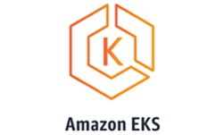

# Deploying a Flask API to EKS

> This project demonstrates how to containerize and deploy a Flask API to a Kubernetes cluster using Docker, AWS EKS, CodePipeline, and CodeBuild.





## Overview

The Flask app that will be used for this project consists of a simple API with three endpoints:

* `GET '/'`: This is a simple health check, which returns the response 'Healthy'. 
* `POST '/auth'`: This takes a email and password as json arguments and returns a JWT based on a custom secret.
* `GET '/contents'`: This requires a valid JWT, and returns the un-encrpyted contents of that token. 

The app relies on a secret set as the environment variable `JWT_SECRET` to produce a JWT. The built-in Flask server is adequate for local development, but not production, so you will be using the production-ready [Gunicorn](https://gunicorn.org/) server when deploying the app.


## Prerequisites

* Docker Desktop - Installation instructions for all OSes can be found <a href="https://docs.docker.com/install/" target="_blank">here</a>.
* Git: <a href="https://git-scm.com/downloads" target="_blank">Download and install Git</a> for your system. 
* Code editor: You can <a href="https://code.visualstudio.com/download" target="_blank">download and install VS code</a> here.
* AWS Account
* Python version between 3.7 and 3.9. Check the current version using:
```bash
#  Mac/Linux/Windows 
python --version
```
You can download a specific release version from <a href="https://www.python.org/downloads/" target="_blank">here</a>.

* Python package manager - PIP 19.x or higher. PIP is already installed in Python 3 >=3.4 downloaded from python.org . However, you can upgrade to a specific version, say 20.2.3, using the command:
```bash
#  Mac/Linux/Windows Check the current version
pip --version
# Mac/Linux
pip install --upgrade pip==20.2.3
# Windows
python -m pip install --upgrade pip==20.2.3
```
* Terminal
   * Mac/Linux users can use the default terminal.
   * Windows users can use either the GitBash terminal or WSL. 
* Command line utilities:
  * AWS CLI installed and configured using the `aws configure` command. Another important configuration is the region. Do not use the us-east-1 because the cluster creation may fails mostly in us-east-1. Let's change the default region to:
  ```bash
  aws configure set region us-east-2  
  ```
  Ensure to create all your resources in a single region. 
  * EKSCTL installed in your system. Follow the instructions [available here](https://docs.aws.amazon.com/eks/latest/userguide/eksctl.html#installing-eksctl) or <a href="https://eksctl.io/introduction/#installation" target="_blank">here</a> to download and install `eksctl` utility. 
  * The KUBECTL installed in your system. Installation instructions for kubectl can be found <a href="https://kubernetes.io/docs/tasks/tools/install-kubectl/" target="_blank">here</a>. 


## Initial setup

1. **Clone the source locally:
```bash
git clone https://github.com/thepembeweb/server-deployment-and-containerization.git
cd server-deployment-and-containerization/
```
1. These are the files relevant for the current project:
```bash
.
├── Dockerfile 
├── README.md
├── aws-auth-patch.yml
├── buildspec.yml
├── ci-cd-codepipeline.cfn.yml
├── iam-role-policy.json
├── main.py
├── requirements.txt
├── simple_jwt_api.yml
├── test_main.py
└── trust.json
```

     
## Project Steps

Completing the project involved the following steps:

1. Writing a Dockerfile for a simple Flask API
2. Building and test the container locally
3. Creating an EKS cluster
4. Storing a secret using AWS Parameter Store
5. Creating a CodePipeline pipeline triggered by GitHub checkins
6. Creating a CodeBuild stage which will build, test, and deploy your code


## Built With

* [Python 3](https://www.python.org/) - The programming language used
* [Flask](https://palletsprojects.com/p/flask/) - The web framework used
* [Amazon EKS](https://aws.amazon.com/eks/) - The managed Kubernetes service used to run Kubernetes in the AWS cloud


## Authors

* **[Pemberai Sweto](https://github.com/thepembeweb)** - *Initial work* - [Server Deployment and Containerization](https://github.com/thepembeweb/server-deployment-and-containerization)

## License

[](http://badges.mit-license.org)

- This project is licensed under the MIT License - see the [LICENSE.md](LICENSE.md) file for details
- Copyright 2022 © [Pemberai Sweto](https://github.com/thepembeweb).

